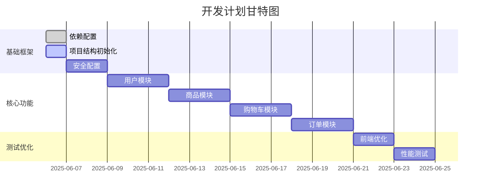

# Spring Boot 在线商店实现计划

## 特性

### 用户类型

未登录用户：可访问首页、商品详情、搜索、注册、登录功能。
已登录用户：可访问首页、商品详情、搜索、购物车、订单功能、用户中心页。
管理员：在已登录用户的基础上还可访问管理员管理页面。

### 页面功能

- 首页：分页展示商品分类，支持点击跳转到对应商品详情。展示指定类别商品。
- 搜索功能：支持模糊搜索，按分类、价格区间、库存量等条件进行搜索。
- 商品详情页：展示商品的详细信息，包括图片、价格、描述等。提供加入购物车的选项。
- 购物车：允许用户查看已加入购物车的商品，并进行批量购买。支持删除。购买后，跳转到订单页。
- 订单页：支持订单信息查询。
- 管理员管理页面：管理员可通过执行 SQL 命令来管理商品、用户等。
- 注册页：用户注册功能。
- 登录页：用户登录功能。
- 用户中心页：展示用户的个人信息，可选择修改个人信息、退出登录、删除账户。

## 1. 项目结构

```plaintext
src/main/java/com/example/qmdzy/
├── config/
│   ├── SecurityConfig.java
│   └── CacheConfig.java
├── controller/
│   ├── AuthController.java
│   ├── ProductController.java
│   ├── CartController.java
│   └── OrderController.java
├── model/
│   ├── User.java
│   ├── Product.java
│   └── Order.java
├── repository/
├── service/
└── util/
```

## 2. 开发路线图



## 3. 实施策略

1. 第一阶段优先级：
   - 完成基础安全认证配置
   - 实现用户注册/登录功能
   - 搭建基础页面模板结构
   - 配置数据库连接和JPA实体

2. 后续阶段：
   - 按模块顺序逐步实现功能
   - 每个模块完成后进行单元测试
   - 最后进行集成测试和性能优化
